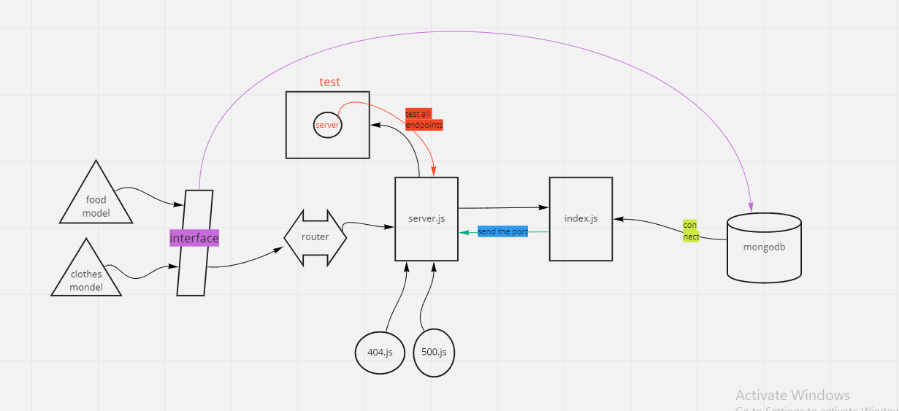

# api-server-postgresql

*Auther: Abeer Rafati*

**This app to explain how to creat a server with postgresql database and added it to db and test it for deployment(Heroku)**   

[Produchion deployment](https://class9-sql.herokuapp.com/)    
[Pull req](https://github.com/AbeerAl-Rafati/api-server-postgresql)   

*To use this app:*
- clone this repo  
- `cd First_api_server` 
- to download all dependencies used in this app, use in terminal 
> `npm i` 
- to run the server use in terminal  
> `nodemon`    

